### Test scenario
Read 20MB file, and return number of read bytes.
```
curl localhost:8080/normal
20971520

curl localhost:8080/virtual
20971520

curl localhost:8080/react
20971520

curl localhost:8080/react-block
20971520

curl localhost:8080/react-block-schedule
20971520

curl localhost:8080/react-block-schedule-parallel
20971520
```
## Note!

Resuls for Normal is not valid, after changing dependency from webflux -> web test fails.

`System.out.println(Thread.currentThread().toString());`

web
Thread[#36,http-nio-8080-exec-1,5,main]

webflux
Thread[#37,reactor-http-epoll-2,5,main]

### Result:


|                                    | Normal  | Virtual                     | Reactive | Reactive B | Reactive BS                     | Reactive BSP                     |
|------------------------------------|---------|-----------------------------|----------|------------|---------------------------------|----------------------------------|
| Requests per second (mean) [#/sec] | 179.79  | 179.54                      | 160.24   | 180.27     | 180.45                          | 177.42                           | 
| 95% percentile [ms]                | 1974    | 2768                        | 2155     | 2173       | 2538                            | 2650                             | 
| Memory peak [MB]                   | < 3000  | < 3000                      | < 3800   | < 2500     | < 3000                          | < 3000                           |
| Threads live peak                  | 29      | 108                         | 455      | 29         | 110                             | 118                              |

### Details:

#### 1. Normal read

`ab -n 10000 -c 300 http://localhost:8080/normal`
```
This is ApacheBench, Version 2.3 <$Revision: 1923142 $>
Copyright 1996 Adam Twiss, Zeus Technology Ltd, http://www.zeustech.net/
Licensed to The Apache Software Foundation, http://www.apache.org/

Benchmarking localhost (be patient)
Completed 1000 requests
Completed 2000 requests
Completed 3000 requests
Completed 4000 requests
Completed 5000 requests
Completed 6000 requests
Completed 7000 requests
Completed 8000 requests
Completed 9000 requests
Completed 10000 requests
Finished 10000 requests


Server Software:        
Server Hostname:        localhost
Server Port:            8080

Document Path:          /normal
Document Length:        8 bytes

Concurrency Level:      300
Time taken for tests:   55.620 seconds
Complete requests:      10000
Failed requests:        0
Total transferred:      780000 bytes
HTML transferred:       80000 bytes
Requests per second:    179.79 [#/sec] (mean)
Time per request:       1668.612 [ms] (mean)
Time per request:       5.562 [ms] (mean, across all concurrent requests)
Transfer rate:          13.69 [Kbytes/sec] received

Connection Times (ms)
min  mean[+/-sd] median   max
Connect:        0    0   0.8      0       7
Processing:    44 1639 238.8   1658    2379
Waiting:       44 1639 238.8   1657    2379
Total:         50 1640 238.4   1658    2380

Percentage of the requests served within a certain time (ms)
50%   1658
66%   1737
75%   1785
80%   1813
90%   1892
95%   1974
98%   2074
99%   2137
100%   2380 (longest request)
```


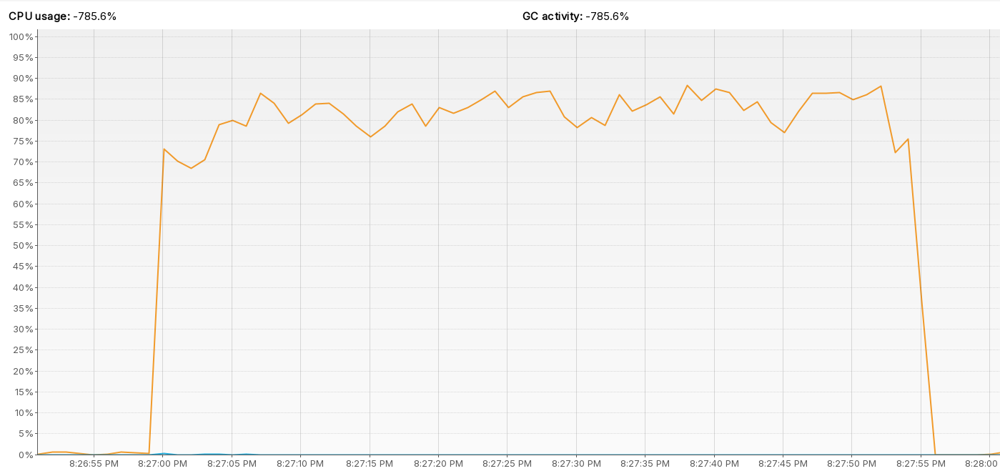
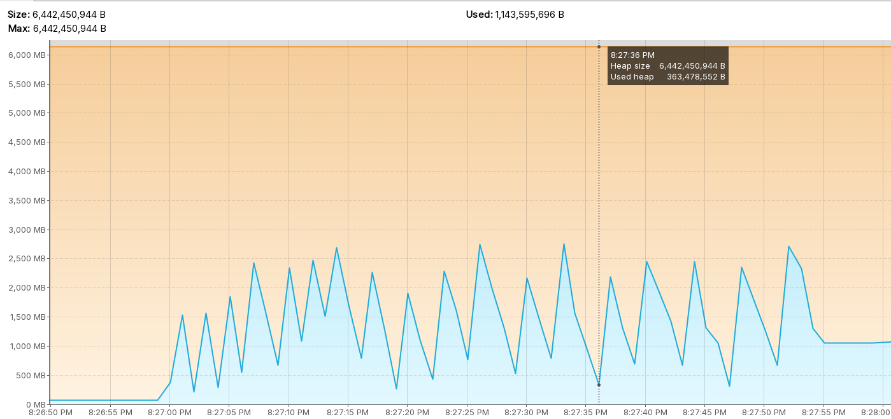
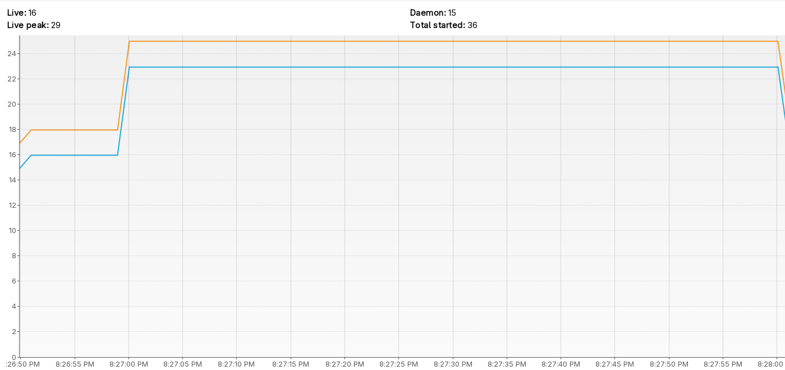

#### 2. Virtual threads

`ab -n 10000 -c 300 http://localhost:8080/virtual`
```
This is ApacheBench, Version 2.3 <$Revision: 1923142 $>
Copyright 1996 Adam Twiss, Zeus Technology Ltd, http://www.zeustech.net/
Licensed to The Apache Software Foundation, http://www.apache.org/

Benchmarking localhost (be patient)
Completed 1000 requests
Completed 2000 requests
Completed 3000 requests
Completed 4000 requests
Completed 5000 requests
Completed 6000 requests
Completed 7000 requests
Completed 8000 requests
Completed 9000 requests
Completed 10000 requests
Finished 10000 requests


Server Software:        
Server Hostname:        localhost
Server Port:            8080

Document Path:          /virtual
Document Length:        8 bytes

Concurrency Level:      300
Time taken for tests:   55.699 seconds
Complete requests:      10000
Failed requests:        0
Total transferred:      780000 bytes
HTML transferred:       80000 bytes
Requests per second:    179.54 [#/sec] (mean)
Time per request:       1670.970 [ms] (mean)
Time per request:       5.570 [ms] (mean, across all concurrent requests)
Transfer rate:          13.68 [Kbytes/sec] received

Connection Times (ms)
min  mean[+/-sd] median   max
Connect:        0    4   9.9      0      77
Processing:   155 1646 623.0   1605    4371
Waiting:      151 1642 622.7   1598    4370
Total:        155 1650 622.7   1608    4375

Percentage of the requests served within a certain time (ms)
50%   1608
66%   1836
75%   2022
80%   2142
90%   2490
95%   2768
98%   3094
99%   3276
100%   4375 (longest request)
```

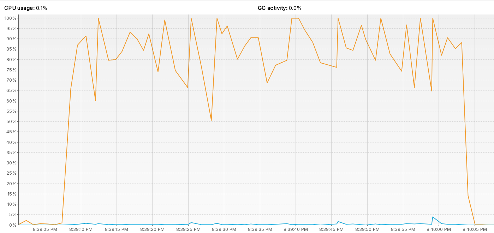
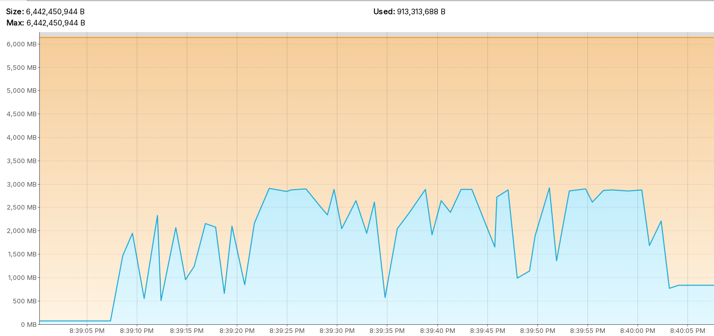
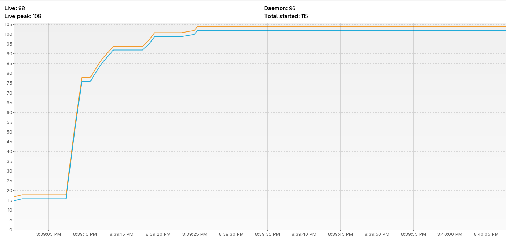

#### 3. Reactive

`ab -n 10000 -c 300 http://localhost:8080/normal`
```
eufrat@eufrat-pc:~/workspace__/write__/java__>
eufrat@eufrat-pc:~/workspace__/write__/java__>
eufrat@eufrat-pc:~/workspace__/write__/java__>
eufrat@eufrat-pc:~/workspace__/write__/java__>
eufrat@eufrat-pc:~/workspace__/write__/java__>
eufrat@eufrat-pc:~/workspace__/write__/java__>
eufrat@eufrat-pc:~/workspace__/write__/java__>
eufrat@eufrat-pc:~/workspace__/write__/java__>
eufrat@eufrat-pc:~/workspace__/write__/java__>
eufrat@eufrat-pc:~/workspace__/write__/java__>
eufrat@eufrat-pc:~/workspace__/write__/java__>
eufrat@eufrat-pc:~/workspace__/write__/java__> ab -n 10000 -c 300 http://localhost:8080/react
This is ApacheBench, Version 2.3 <$Revision: 1923142 $>
Copyright 1996 Adam Twiss, Zeus Technology Ltd, http://www.zeustech.net/
Licensed to The Apache Software Foundation, http://www.apache.org/

Benchmarking localhost (be patient)
Completed 1000 requests
Completed 2000 requests
Completed 3000 requests
Completed 4000 requests
Completed 5000 requests
Completed 6000 requests
Completed 7000 requests
Completed 8000 requests
Completed 9000 requests
Completed 10000 requests
Finished 10000 requests


Server Software:        
Server Hostname:        localhost
Server Port:            8080

Document Path:          /react
Document Length:        8 bytes

Concurrency Level:      300
Time taken for tests:   62.406 seconds
Complete requests:      10000
Failed requests:        0
Total transferred:      780000 bytes
HTML transferred:       80000 bytes
Requests per second:    160.24 [#/sec] (mean)
Time per request:       1872.194 [ms] (mean)
Time per request:       6.241 [ms] (mean, across all concurrent requests)
Transfer rate:          12.21 [Kbytes/sec] received

Connection Times (ms)
min  mean[+/-sd] median   max
Connect:        0    1   2.6      0      55
Processing:   248 1855 241.3   1873    3160
Waiting:      241 1854 241.1   1872    3159
Total:        248 1856 241.5   1874    3160

Percentage of the requests served within a certain time (ms)
50%   1874
66%   1926
75%   1961
80%   1981
90%   2049
95%   2155
98%   2527
99%   2644
100%   3160 (longest request)
```


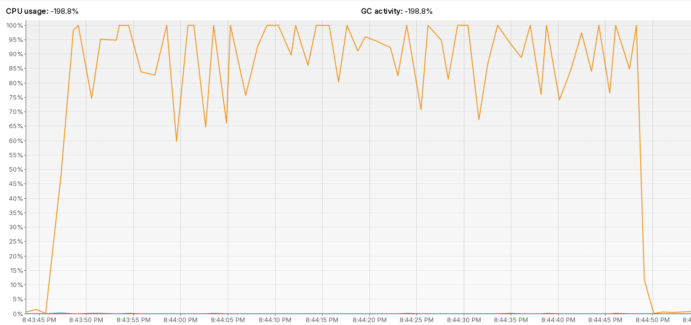
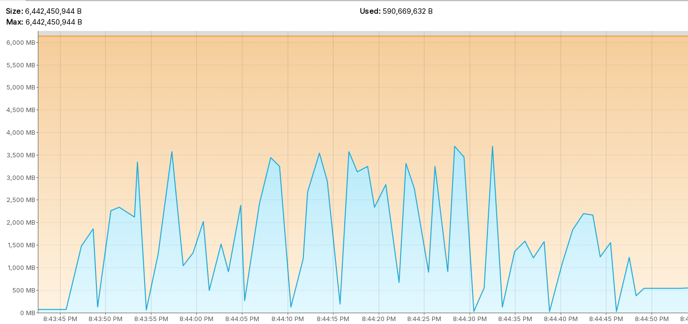
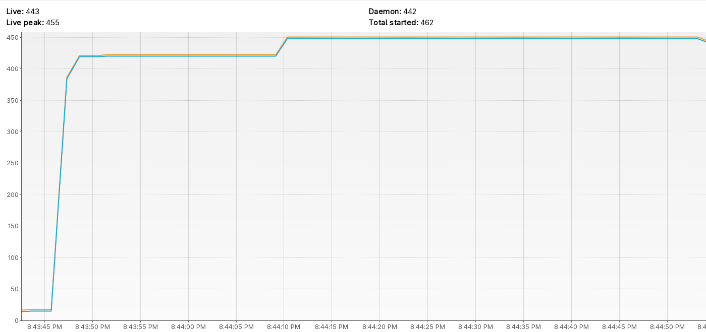

#### 4. Reactive blocking

`ab -n 10000 -c 300 http://localhost:8080/react-block`
```
This is ApacheBench, Version 2.3 <$Revision: 1923142 $>
Copyright 1996 Adam Twiss, Zeus Technology Ltd, http://www.zeustech.net/
Licensed to The Apache Software Foundation, http://www.apache.org/

Benchmarking localhost (be patient)
Completed 1000 requests
Completed 2000 requests
Completed 3000 requests
Completed 4000 requests
Completed 5000 requests
Completed 6000 requests
Completed 7000 requests
Completed 8000 requests
Completed 9000 requests
Completed 10000 requests
Finished 10000 requests


Server Software:        
Server Hostname:        localhost
Server Port:            8080

Document Path:          /react-block
Document Length:        8 bytes

Concurrency Level:      300
Time taken for tests:   55.472 seconds
Complete requests:      10000
Failed requests:        0
Total transferred:      780000 bytes
HTML transferred:       80000 bytes
Requests per second:    180.27 [#/sec] (mean)
Time per request:       1664.160 [ms] (mean)
Time per request:       5.547 [ms] (mean, across all concurrent requests)
Transfer rate:          13.73 [Kbytes/sec] received

Connection Times (ms)
min  mean[+/-sd] median   max
Connect:        0    0   0.9      0       7
Processing:    39 1636 360.1   1660    2585
Waiting:       39 1635 360.1   1660    2584
Total:         45 1636 359.8   1660    2585

Percentage of the requests served within a certain time (ms)
50%   1660
66%   1806
75%   1890
80%   1943
90%   2069
95%   2173
98%   2299
99%   2385
100%   2585 (longest request)
```


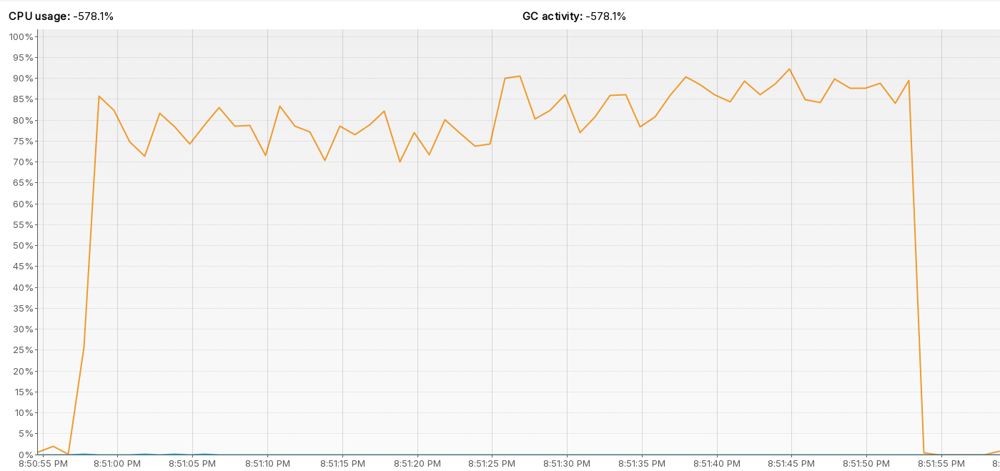
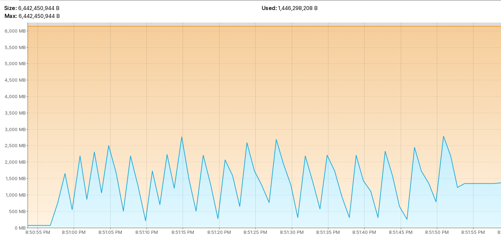
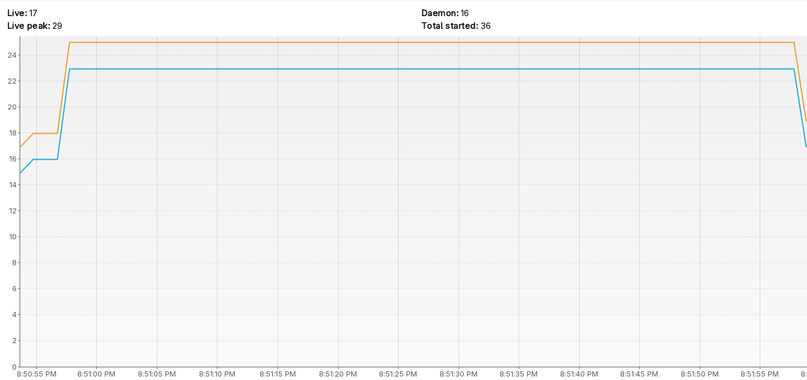

#### 5. Reactive blocking with bounded scheduler

`ab -n 10000 -c 300 http://localhost:8080/react-block-schedule`
```
This is ApacheBench, Version 2.3 <$Revision: 1923142 $>
Copyright 1996 Adam Twiss, Zeus Technology Ltd, http://www.zeustech.net/
Licensed to The Apache Software Foundation, http://www.apache.org/

Benchmarking localhost (be patient)
Completed 1000 requests
Completed 2000 requests
Completed 3000 requests
Completed 4000 requests
Completed 5000 requests
Completed 6000 requests
Completed 7000 requests
Completed 8000 requests
Completed 9000 requests
Completed 10000 requests
Finished 10000 requests


Server Software:        
Server Hostname:        localhost
Server Port:            8080

Document Path:          /react-block-schedule
Document Length:        8 bytes

Concurrency Level:      300
Time taken for tests:   55.418 seconds
Complete requests:      10000
Failed requests:        0
Total transferred:      780000 bytes
HTML transferred:       80000 bytes
Requests per second:    180.45 [#/sec] (mean)
Time per request:       1662.539 [ms] (mean)
Time per request:       5.542 [ms] (mean, across all concurrent requests)
Transfer rate:          13.74 [Kbytes/sec] received

Connection Times (ms)
min  mean[+/-sd] median   max
Connect:        0    7  12.1      1      79
Processing:   169 1634 500.9   1589    4016
Waiting:      162 1628 500.2   1585    4016
Total:        169 1641 500.3   1594    4016

Percentage of the requests served within a certain time (ms)
50%   1594
66%   1788
75%   1921
80%   2014
90%   2297
95%   2538
98%   2868
99%   3090
100%   4016 (longest request)
```

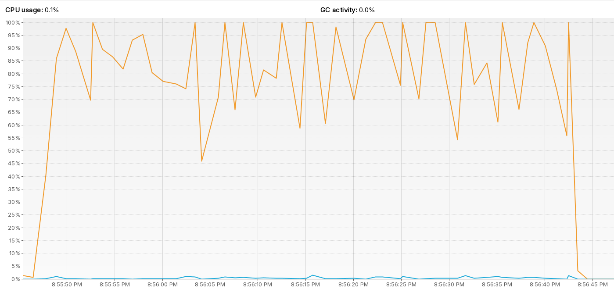
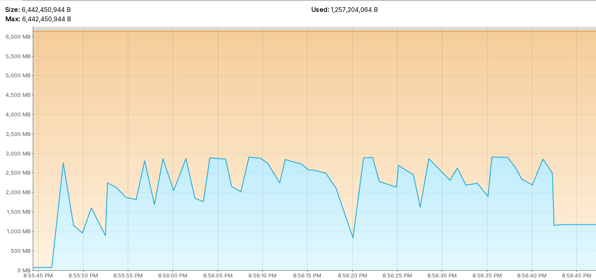
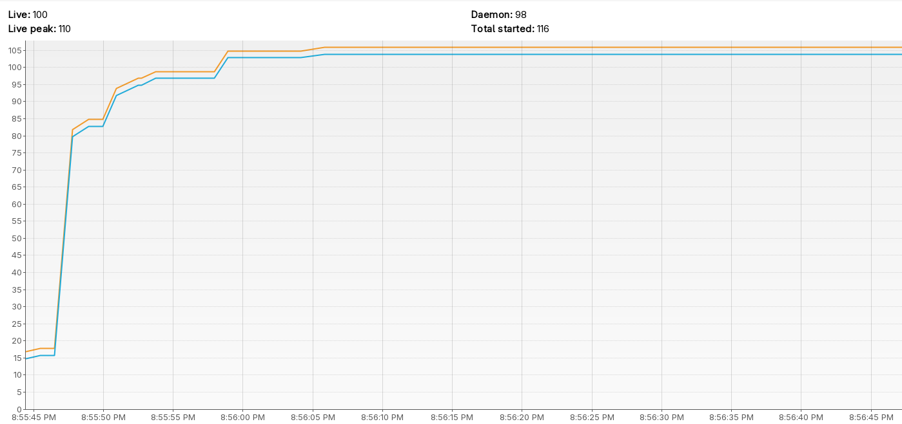

#### 6. Reactive blocking with bounded scheduler and parallel

`ab -n 10000 -c 300 http://localhost:8080/react-block-schedule-parallel`
```
This is ApacheBench, Version 2.3 <$Revision: 1923142 $>
Copyright 1996 Adam Twiss, Zeus Technology Ltd, http://www.zeustech.net/
Licensed to The Apache Software Foundation, http://www.apache.org/

Benchmarking localhost (be patient)
Completed 1000 requests
Completed 2000 requests
Completed 3000 requests
Completed 4000 requests
Completed 5000 requests
Completed 6000 requests
Completed 7000 requests
Completed 8000 requests
Completed 9000 requests
Completed 10000 requests
Finished 10000 requests


Server Software:        
Server Hostname:        localhost
Server Port:            8080

Document Path:          /react-block-schedule-parallel
Document Length:        8 bytes

Concurrency Level:      300
Time taken for tests:   56.364 seconds
Complete requests:      10000
Failed requests:        0
Total transferred:      780000 bytes
HTML transferred:       80000 bytes
Requests per second:    177.42 [#/sec] (mean)
Time per request:       1690.906 [ms] (mean)
Time per request:       5.636 [ms] (mean, across all concurrent requests)
Transfer rate:          13.51 [Kbytes/sec] received

Connection Times (ms)
min  mean[+/-sd] median   max
Connect:        0    8  12.3      1      95
Processing:   169 1661 542.4   1635    4871
Waiting:      169 1654 541.7   1626    4870
Total:        169 1668 542.0   1643    4872

Percentage of the requests served within a certain time (ms)
50%   1643
66%   1837
75%   1973
80%   2052
90%   2370
95%   2650
98%   2988
99%   3193
100%   4872 (longest request)
```

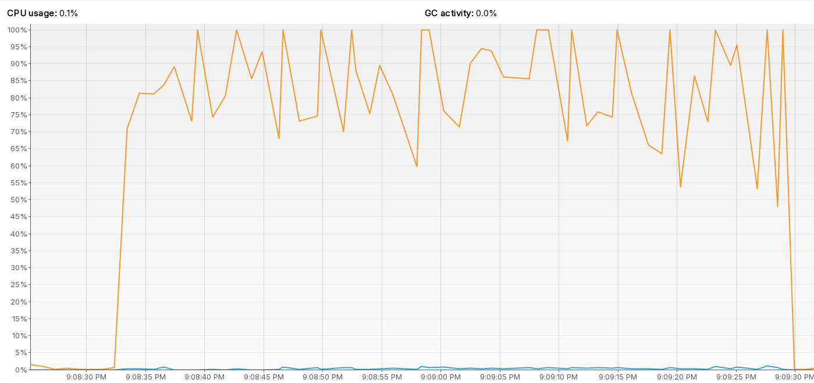
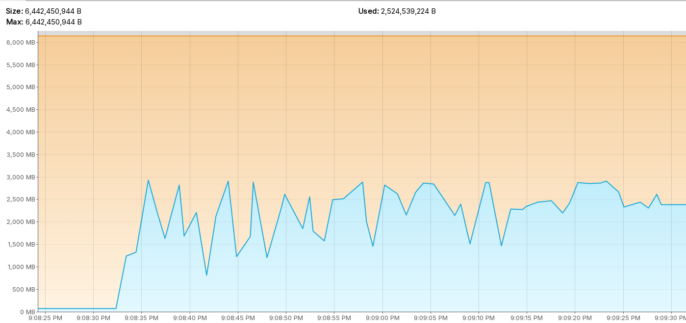
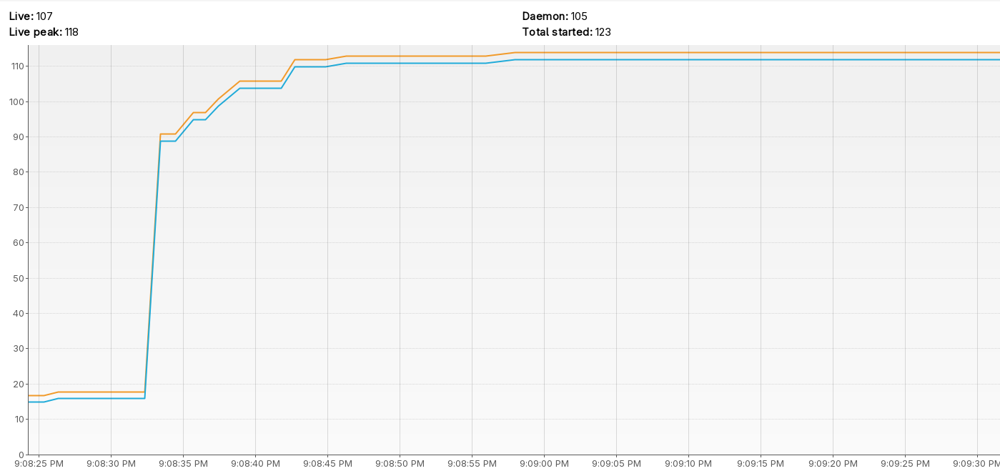